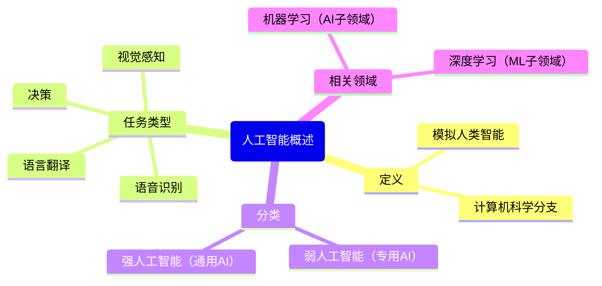

# Mind Map Skill

思维导图技能 - 总结文本关键点并以图形化方式展示。

## 功能描述

此技能从输入文本中提取关键点，构建层次结构，并生成思维导图的可视化表示。支持生成 Mermaid 代码（可在支持 Mermaid 的 Markdown 编辑器中渲染）、文本树状图和 JSON 结构。当用户需要快速理解长文本的核心内容、梳理逻辑结构或创建可视化摘要时，AI 可以调用此技能。

## 使用场景

- 总结长文档、文章或报告的核心观点
- 提取会议记录、谈话内容的关键要点
- 构建知识图谱或概念关系图
- 创建演讲或演示文稿的大纲
- 分析问题并梳理解决方案框架
- 学习笔记整理和知识结构化

## 参数说明

### text (必需)
- **类型**: string
- **描述**: 要分析的文本内容

### language (可选)
- **类型**: string
- **枚举值**: `auto`, `zh`, `en`
- **默认值**: `auto`
- **描述**: 文本语言
  - `auto`: 自动检测（默认）
  - `zh`: 中文文本
  - `en`: 英文文本

### max_depth (可选)
- **类型**: integer
- **默认值**: 3
- **最小值**: 1
- **最大值**: 5
- **描述**: 思维导图的最大深度。深度越大，结构越详细。

### generate_mermaid (可选)
- **类型**: boolean
- **默认值**: true
- **描述**: 是否生成 Mermaid 代码。Mermaid 是一种图表描述语言，可在支持 Mermaid 的 Markdown 编辑器中渲染为思维导图。

### generate_text_tree (可选)
- **类型**: boolean
- **默认值**: true
- **描述**: 是否生成文本树状图。文本树状图是一种纯文本格式的层次结构表示，适合在终端或简单文本环境中查看。

## 返回值

返回 JSON 对象，包含以下字段：

### 成功时
```json
{
  "success": true,
  "hierarchy": {
    "id": "root",
    "label": "核心主题",
    "children": [
      {
        "id": "node1",
        "label": "主要观点1",
        "children": [...]
      }
    ]
  },
  "summary": "主题: 核心主题 | 主要观点: 观点1, 观点2, 观点3",
  "mermaid_code": "mindmap\n  root(\"核心主题\")\n    主要观点1\n      子观点1\n      子观点2\n    主要观点2",
  "mermaid_diagram_type": "mindmap",
  "text_tree": "核心主题\n├── 主要观点1\n│   ├── 子观点1\n│   └── 子观点2\n└── 主要观点2",
  "stats": {
    "total_nodes": 5,
    "max_depth": 3,
    "root_label": "核心主题"
  }
}
```

### 字段说明
- **hierarchy**: 完整的层次结构数据，包含 id、label 和 children 字段
- **summary**: 文本摘要，包含核心主题和主要观点
- **mermaid_code**: Mermaid 格式的思维导图代码，可在支持 Mermaid 的环境中使用
- **mermaid_diagram_type**: 图表类型，固定为 "mindmap"
- **text_tree**: 文本树状图，使用 ASCII 字符表示层次结构
- **stats**: 统计信息，包括节点总数、最大深度和根节点标签

### 失败时
```json
{
  "success": false,
  "error": "生成思维导图失败: [错误详情]"
}
```

## 使用示例

### 示例 1: 生成完整的思维导图

**用户**: 请为以下文本生成思维导图："人工智能是计算机科学的一个分支，旨在创造能够执行通常需要人类智能的任务的机器。这些任务包括视觉感知、语音识别、决策和语言翻译。人工智能可以分为弱人工智能和强人工智能。弱人工智能专注于特定任务，而强人工智能则具有通用智能，可以执行任何人类智能任务。机器学习是人工智能的一个子领域，它使计算机能够在没有明确编程的情况下学习。深度学习是机器学习的一种，使用神经网络模拟人脑的工作方式。"

**AI 调用**:
```json
{
  "function": "mind_map",
  "arguments": {
    "text": "人工智能是计算机科学的一个分支...",
    "max_depth": 3
  }
}
```

**返回**:
```json
{
  "success": true,
  "hierarchy": {
    "id": "root",
    "label": "人工智能概述",
    "children": [
      {
        "id": "node1",
        "label": "定义",
        "children": [
          {
            "id": "node1_1",
            "label": "计算机科学分支",
            "children": []
          },
          {
            "id": "node1_2",
            "label": "模拟人类智能",
            "children": []
          }
        ]
      },
      {
        "id": "node2",
        "label": "任务类型",
        "children": [
          {
            "id": "node2_1",
            "label": "视觉感知",
            "children": []
          },
          {
            "id": "node2_2",
            "label": "语音识别",
            "children": []
          },
          {
            "id": "node2_3",
            "label": "决策",
            "children": []
          },
          {
            "id": "node2_4",
            "label": "语言翻译",
            "children": []
          }
        ]
      },
      {
        "id": "node3",
        "label": "分类",
        "children": [
          {
            "id": "node3_1",
            "label": "弱人工智能（专用AI）",
            "children": []
          },
          {
            "id": "node3_2",
            "label": "强人工智能（通用AI）",
            "children": []
          }
        ]
      },
      {
        "id": "node4",
        "label": "相关领域",
        "children": [
          {
            "id": "node4_1",
            "label": "机器学习（AI子领域）",
            "children": []
          },
          {
            "id": "node4_2",
            "label": "深度学习（ML子领域）",
            "children": []
          }
        ]
      }
    ]
  },
  "summary": "主题: 人工智能概述 | 主要观点: 定义, 任务类型, 分类, 相关领域",
  "mermaid_code": "mindmap\n  root(\"人工智能概述\")\n    定义\n      计算机科学分支\n      模拟人类智能\n    任务类型\n      视觉感知\n      语音识别\n      决策\n      语言翻译\n    分类\n      弱人工智能（专用AI）\n      强人工智能（通用AI）\n    相关领域\n      机器学习（AI子领域）\n      深度学习（ML子领域）",
  "mermaid_diagram_type": "mindmap",
  "text_tree": "人工智能概述\n├── 定义\n│   ├── 计算机科学分支\n│   └── 模拟人类智能\n├── 任务类型\n│   ├── 视觉感知\n│   ├── 语音识别\n│   ├── 决策\n│   └── 语言翻译\n├── 分类\n│   ├── 弱人工智能（专用AI）\n│   └── 强人工智能（通用AI）\n└── 相关领域\n    ├── 机器学习（AI子领域）\n    └── 深度学习（ML子领域）",
  "stats": {
    "total_nodes": 13,
    "max_depth": 3,
    "root_label": "人工智能概述"
  }
}
```

**AI 回复**: 我已为文本生成思维导图。核心主题是"人工智能概述"，包含四个主要分支：定义、任务类型、分类和相关领域。思维导图共包含13个节点，最大深度为3层。以下是文本树状图表示：

```
人工智能概述
├── 定义
│   ├── 计算机科学分支
│   └── 模拟人类智能
├── 任务类型
│   ├── 视觉感知
│   ├── 语音识别
│   ├── 决策
│   └── 语言翻译
├── 分类
│   ├── 弱人工智能（专用AI）
│   └── 强人工智能（通用AI）
└── 相关领域
    ├── 机器学习（AI子领域）
    └── 深度学习（ML子领域）
```

如需在 Markdown 中使用可视化思维导图，可以使用以下 Mermaid 代码：


---

### 示例 2: 仅生成文本树状图

**用户**: 帮我总结这段会议记录，只要文本树状图就行。

**AI 调用**:
```json
{
  "function": "mind_map",
  "arguments": {
    "text": "会议讨论了Q1业绩...",
    "generate_mermaid": false,
    "generate_text_tree": true
  }
}
```

**返回**:
```json
{
  "success": true,
  "hierarchy": {...},
  "summary": "主题: Q1业绩回顾 | 主要观点: 营收增长, 成本控制, 市场挑战",
  "text_tree": "Q1业绩回顾\n├── 营收增长\n│   ├── 同比增长20%\n│   └── 主要贡献来自新产品\n├── 成本控制\n│   ├── 运营成本降低5%\n│   └── 营销效率提升\n└── 市场挑战\n    ├── 竞争加剧\n    └── 客户需求变化",
  "stats": {...}
}
```

**AI 回复**: 会议记录摘要的文本树状图如下：
```
Q1业绩回顾
├── 营收增长
│   ├── 同比增长20%
│   └── 主要贡献来自新产品
├── 成本控制
│   ├── 运营成本降低5%
│   └── 营销效率提升
└── 市场挑战
    ├── 竞争加剧
    └── 客户需求变化
```

---

### 示例 3: 自定义深度和语言

**用户**: 请用英文为这篇技术文档生成思维导图，深度限制在2层。

**AI 调用**:
```json
{
  "function": "mind_map",
  "arguments": {
    "text": "The document describes...",
    "language": "en",
    "max_depth": 2
  }
}
```

## 技术实现

### 核心算法
1. **关键点提取**: 使用 OpenAI GPT 模型分析文本，识别核心主题、主要观点和支持细节
2. **层次构建**: 根据逻辑关系构建树状结构，确保层次清晰
3. **格式转换**: 将层次结构转换为多种输出格式

### 后备机制
- 当 OpenAI API 不可用时，使用基于规则的后备方法（文本分割和简单关键词提取）
- 后备方法虽然简单，但仍能生成基本的结构

### 依赖
- **主要依赖**: `openai` (可选，用于高质量提取)
- **标准库**: `json`, `re`, `sys`, `os`
- **后备处理**: 无额外依赖

### 输出格式
- **JSON 层次结构**: 完整的结构化数据，便于程序处理
- **Mermaid 代码**: 标准化图表描述语言，广泛支持
- **文本树状图**: 纯 ASCII 表示，兼容性强

## 错误处理

可能的错误情况：
1. **API 连接失败**: 当 OpenAI API 不可达时，自动切换到后备方法
2. **文本过长**: 目前无硬性长度限制，但极长文本可能影响性能
3. **无效参数**: 参数验证失败时返回具体错误信息
4. **JSON 解析失败**: 当模型返回无效 JSON 时，使用后备方法

错误返回格式：
```json
{
  "success": false,
  "error": "生成思维导图失败: [错误详情]"
}
```

## 版本历史

- **v1.0** (2025-03-07): 初始版本
  - 支持文本关键点提取和层次构建
  - 生成 Mermaid 代码和文本树状图
  - 支持中英文文本
  - 集成 OpenAI API 和后备方法
  - 可配置深度和输出格式

## 性能考虑

- **文本长度**: 适合处理段落到中等长度文档（建议不超过 5000 字）
- **API 调用**: 使用 OpenAI API 时，响应时间取决于网络和模型负载
- **内存使用**: 层次结构在内存中构建，对于极大深度可能需注意

## 扩展建议

未来的改进方向：
1. 支持更多输出格式（如 PlantUML、Graphviz DOT）
2. 添加本地 NLP 模型支持（如 jieba、spaCy）
3. 支持多文档分析和比较
4. 添加交互式编辑功能
5. 集成更多图表类型（流程图、时序图等）

## 作者

AI Chat Platform Skills Team

## 许可证

MIT License